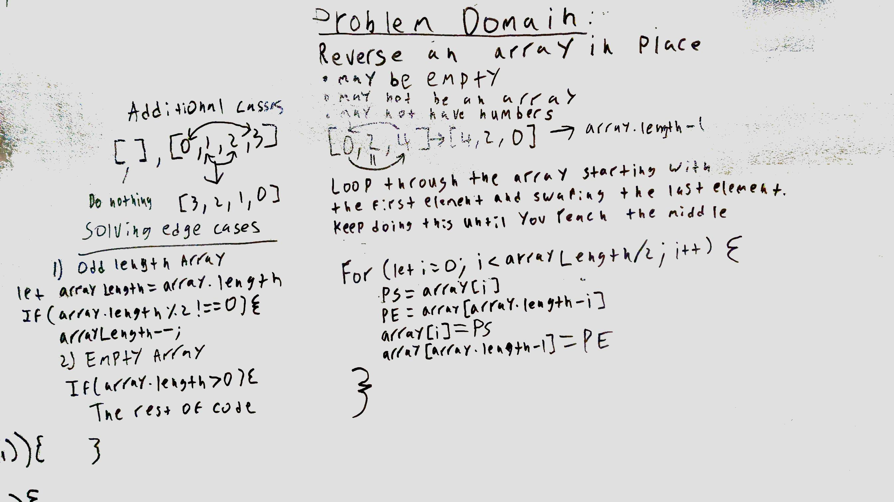

# Challenge Summary
<!-- Short summary or background information -->
The purpose of this assignment was to reverse an array in place.

## Challenge Description
<!-- Description of the challenge -->
Reverse an array in place that may be empty, may have different date types and may not be in an array.

## Approach & Efficiency
<!-- What approach did you take? Why? What is the Big O space/time for this approach? -->
The approach I took was to first find the middle of an array. Then using a for loop to then replace the first element and visa versa moving inwards until the entire array is reversed. 

My solution is O(n) because it uses 1 for loop.

## Solution
<!-- Embedded whiteboard image -->
