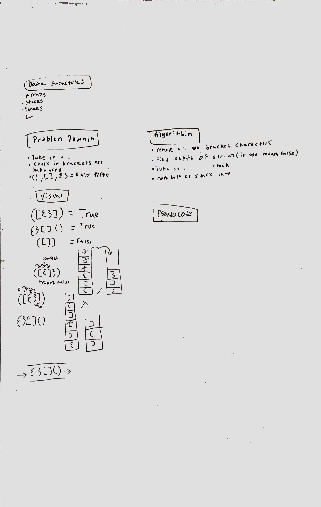

# Challenge Summary
<!-- Short summary or background information -->
This challenge is to take a string and to return whether the brackets in the string are balanced.

## Challenge Description
<!-- Description of the challenge -->
Check a string to see if it contains matching brackets

## Approach & Efficiency
<!-- What approach did you take? Why? What is the Big O space/time for this approach? -->
My approach was to clear out the string of anything that wasn't brackets. Then the string would be loaded into a stack. If the bracket is opened it gets pushed into the stack but if it is closed it is popped and compared. 

 This solution is O(n) for time because I am using 1 loop to iterate over a lists and 0(n) for space because I am creating a stack that will grow with a larger input.

## Solution
<!-- Embedded whiteboard image -->
