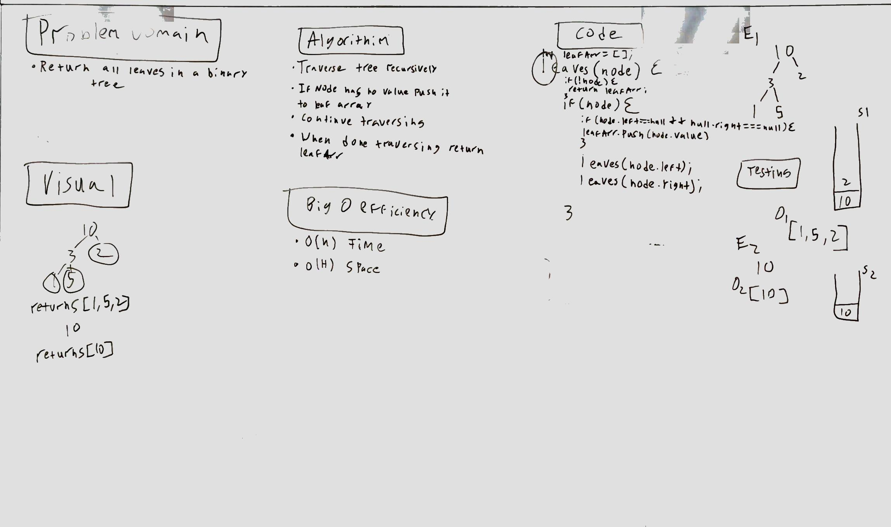

# Challenge Summary
<!-- Short summary or background information -->
This challenge is to traverse a binary tree and to return all of the trees leaves.

## Challenge Description
<!-- Description of the challenge -->
Use depth first or breadth first to return all the leaves in a binary tree.

## Approach & Efficiency
<!-- What approach did you take? Why? What is the Big O space/time for this approach? -->
My approach is to recursively travers the tree in order. If a node has no left and no right children then it is push to an array.

 This solution is O(n) for time because I am using recursion to loop through the binary tree. The space is 0(n)* for space because I am creating a stack that will grow with a larger input.

## Solution
<!-- Embedded whiteboard image -->
