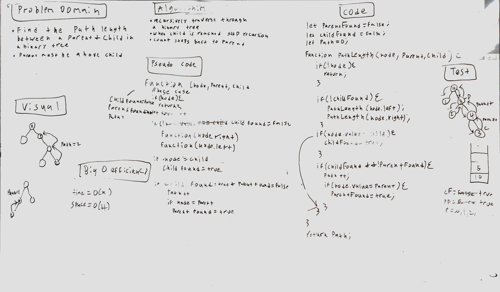

# Challenge Summary
<!-- Short summary or background information -->
This challenge is to traverse a binary tree and to return the path length between a parent and child

## Challenge Description
<!-- Description of the challenge -->
Use depth first or breadth first to return the length of a path between 2 nodes.

## Approach & Efficiency
<!-- What approach did you take? Why? What is the Big O space/time for this approach? -->
My approach is to recursively traverse the tree until the child is reached. Then the recursion is stopped and the number of nodes until the parent are counted.

 This solution is O(n) for time because I am using recursion to loop through the binary tree. The space is 0(H)* for space because I am creating a stack that will no more than the height of the tree.

## Solution
<!-- Embedded whiteboard image -->
