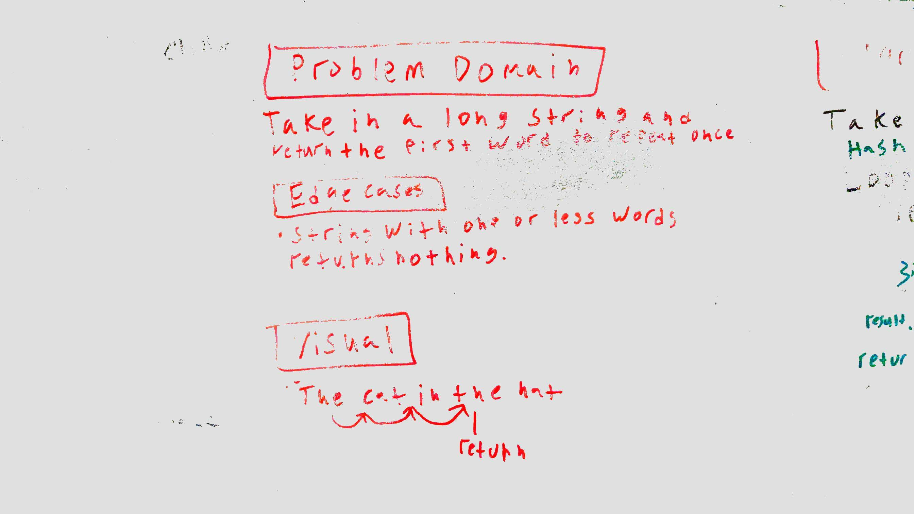
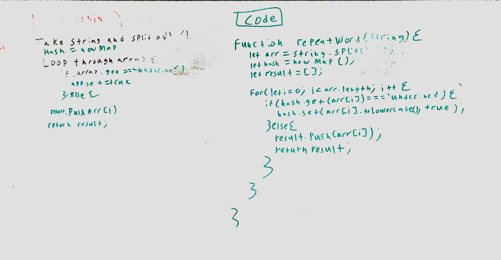

# Challenge Summary
<!-- Short summary or background information -->
This challenge is to find the first word to repeat in a string. 

## Challenge Description
<!-- Description of the challenge -->
Use a hash to find the first word to show up more then once in a string and then to return it.

## Approach & Efficiency
<!-- What approach did you take? Why? What is the Big O space/time for this approach? -->
My approach was to loop through the array and for any array item that was missing a key to set its key = to true. Then when an existing work appears again it is push to results are.

 This solution is O(n) for time because I am using a loop. The space is 0(n)* for space because I am using an array that may need to be resized.

## Solution
<!-- Embedded whiteboard image -->

