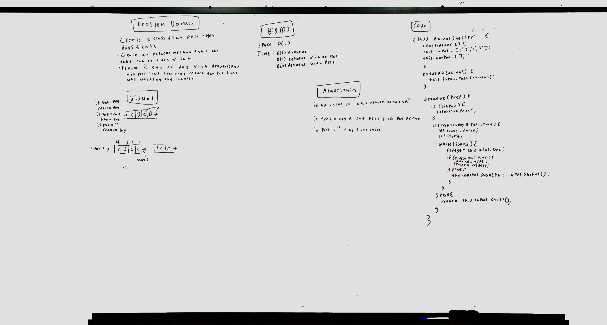

# Challenge Summary
<!-- Short summary or background information -->
This challenge is to add dogs or cats to a shelter and then be able to return them in a fifo manner.

## Challenge Description
<!-- Description of the challenge -->
Use enqueue and dequeue to add and remove pets from a queue.

## Approach & Efficiency
<!-- What approach did you take? Why? What is the Big O space/time for this approach? -->
My approach was to use an array as a queue. When ann animal was added if it was a cat is was added to the cat queue and if it was a dog it was added to the dog queue each as an id. When removing the pet from the queues the id is used to indicate which pet has been there longer.

 This solution is O(1) for time because I am using a queue. 
 
 The space is 0(1) because for each additional animal we add it the queue only once.
.
## Solution
<!-- Embedded whiteboard image -->
