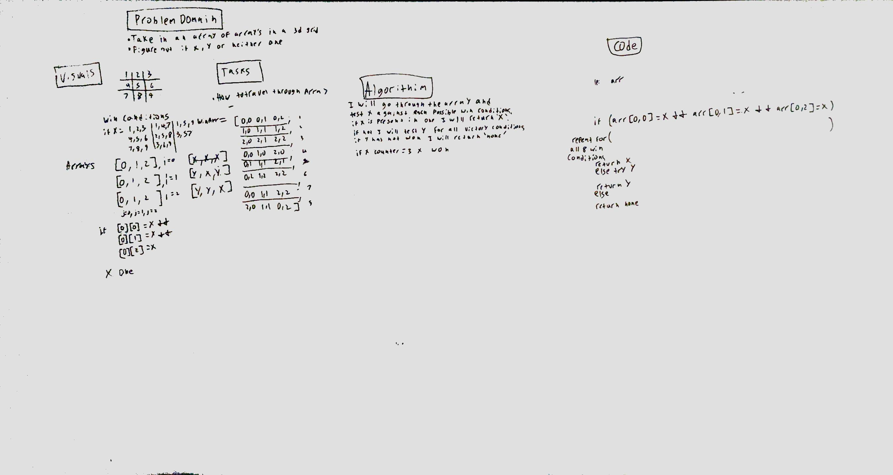

# Challenge Summary
<!-- Short summary or background information -->
This challenge is to evaluate a tac toe board to determine weather x or o has won.

## Challenge Description
<!-- Description of the challenge -->
Take in a 2d array representing a 3x3 tic tac toe grid and determine who the winner is.

## Approach & Efficiency
<!-- What approach did you take? Why? What is the Big O space/time for this approach? -->
My approach was to evaluate a tic board 3 different ways, horizontally, vertically, and diagonally. For each direction I evaluated if the array values were all the same. If they were I compared them and returned which player won if there was 3 in a row. This function is O(n) efficiency because it uses one level of for loops.

## Solution
<!-- Embedded whiteboard image -->
