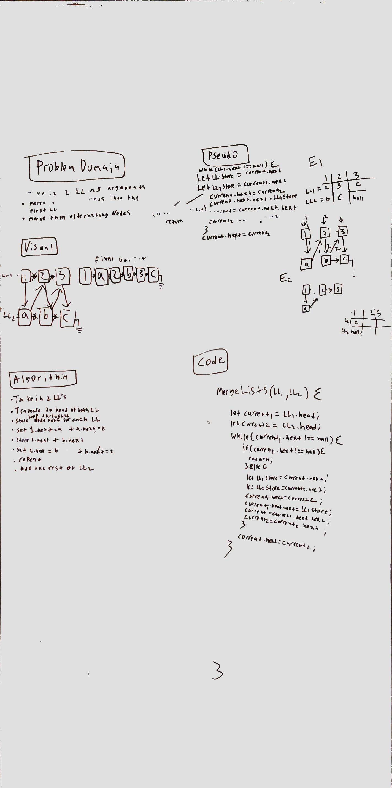

# Challenge Summary
<!-- Short summary or background information -->
This challenge is to merge 2 linked lists together in the first linked list.

## Challenge Description
<!-- Description of the challenge -->
Merge linked lists into one alternating values.

## Approach & Efficiency
<!-- What approach did you take? Why? What is the Big O space/time for this approach? -->
My approach was to store the next value of each array and then use that to set the next value of array 1 and array 2 and then chain them together. I would then move down the list and repeat the process. For the last value of LL2 I would set it = null in the case that it was shorter. 
 This solution is O(n) for time because I am using 1 loop to iterate over 2 linked lists and 0(1) for space because I am just reusing the linked lists we were given.

## Solution
<!-- Embedded whiteboard image -->
