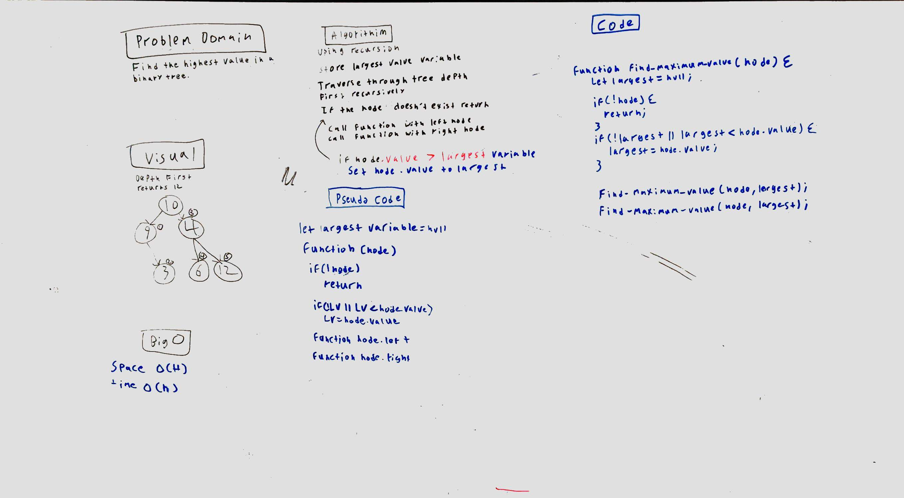

# Links
* [travis](https://travis-ci.com/EvanBC1/data-structures-and-algorithm)

# Challenge Summary
<!-- Short summary or background information -->
This challenge is to traverse a binary tree and to return the largest node.

## Challenge Description
<!-- Description of the challenge -->
Use depth first or breadth first to return the node with largest value.

## Approach & Efficiency
<!-- What approach did you take? Why? What is the Big O space/time for this approach? -->
My approach is to recursively traverse the tree keeping track of the largest node found until the end.

 This solution is O(n) for time because I am using recursion to loop through the binary tree. The space is 0(H)* for space because I am creating a stack that will no more than the height of the tree.

## Solution
<!-- Embedded whiteboard image -->
