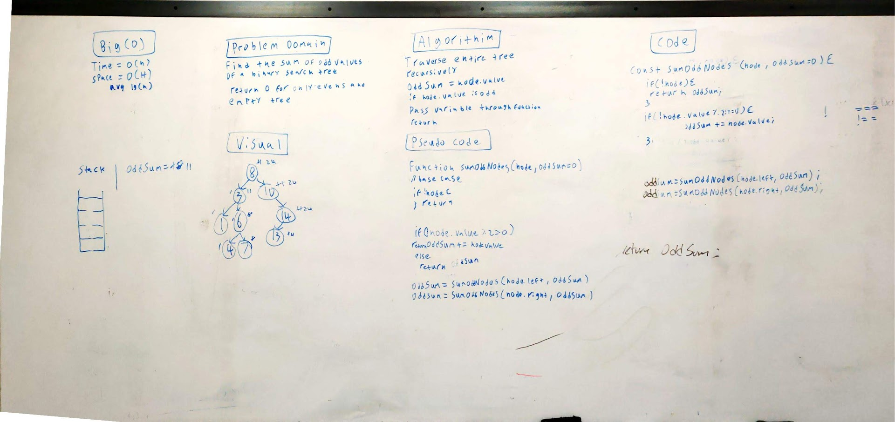

# Challenge Summary
<!-- Short summary or background information -->
This challenge is to add up all of the odd nodes of a binary search tree.

## Challenge Description
<!-- Description of the challenge -->
Use depth first or breadth first to sum the nodes of a binary search tree.

## Approach & Efficiency
<!-- What approach did you take? Why? What is the Big O space/time for this approach? -->
My approach is to recursively traverse the tree adding up all the odd numbered nodes along the way.

 This solution is O(n) for time because I am using recursion to loop through the binary tree. 
 
 The space is 0(H) for the worst case and log(n) for the average case for space because I am creating a stack that will no more than the height of the tree. Howe

## Solution
<!-- Embedded whiteboard image -->
